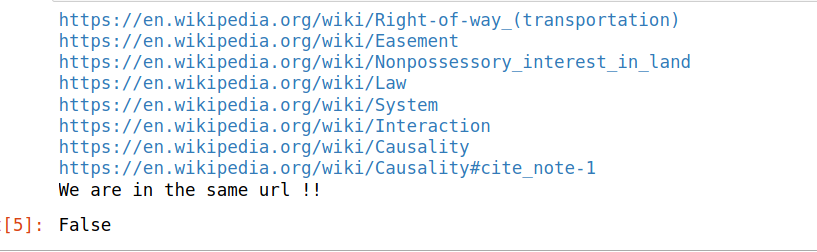
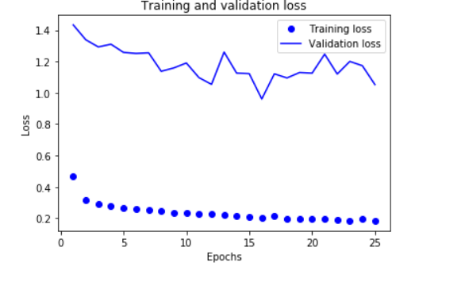
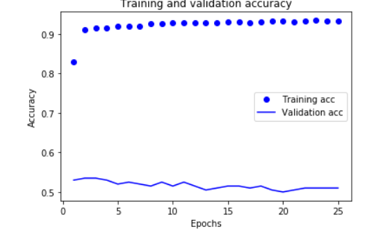

# Widebot_Internship
WideBot Internship

Task 1 - Getting to Philosophy

Given the training and validation datasets, http://bit.ly/widebot-new-binclf-data  , Create and train a machine learning model using the training set that performs well on the validation set.

Please write a Python script to check the "Getting to Philosophy" law.
https://en.wikipedia.org/wiki/Wikipedia:Getting_to_Philosophy
 
Clicking on the first link in the main body of a Wikipedia article and repeating the process for subsequent articles would usually lead to the article Philosophy.
 
The program should receive a Wikipedia link as an input, go to another normal link and repeat this process until either Philosophy page is reached, or we are in an article without any outgoing Wikilinks, or stuck in a loop.
 
A "normal link" is a link from the main page article, not in a box, is blue (red is for non-existing articles), not in parentheses, not italic and not a footnote. You don't have to check style tables or other fancy things, it is enough that the script works with the current Wikipedia style (for example you can use 'class' attribute in Wikipedia tags). For easy validation, please print all visited links to the standard output.
 
Use a 0.5 second timeout between queries to avoid heavy load on Wikipedia (sleep function from time module).
 
You can use https://en.wikipedia.org/wiki/Special:Random to check this hypothesis at home.
 

**Task Requirments Line:**

- pip install selenium
- firfox geckodriver

**Screenshot output:**

  

Task 2 - Binary Classification Problem

Given the training and validation datasets, http://bit.ly/widebot-new-binclf-data  , Create and train a machine learning model using the training set that performs well on the validation set.

**Pre-Process PIP Line:**

- handle target class
- handle Nan Values
- Impute the missing values
- Encode categorical features
- Features Scaling for continuous features

**Machine Learning Models:**

## Model Evaluation
|Model| Training | Testing |
| :---: | :---: | :---: |
| Logistic Regression | 92 | 47|
| MultinomialNB | 72 | 47 |

**Screenshots output:**

  
  

